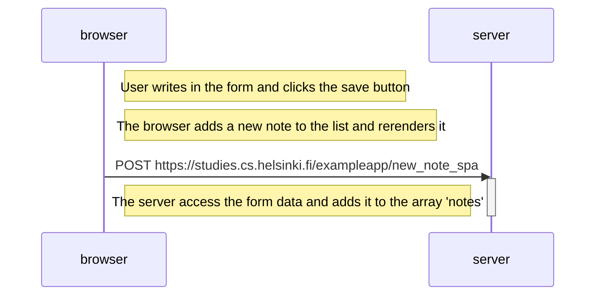

```mermaid
sequenceDiagram
    participant browser
    participant server

    Note right of browser: User writes in the form and clicks the save button
    Note right of browser: The browser adds a new note to the list and rerenders it
    browser->>server: POST https://studies.cs.helsinki.fi/exampleapp/new_note_spa
    activate server
    Note left of server: The server access the form data and adds it to the array 'notes'
    deactivate server
```
